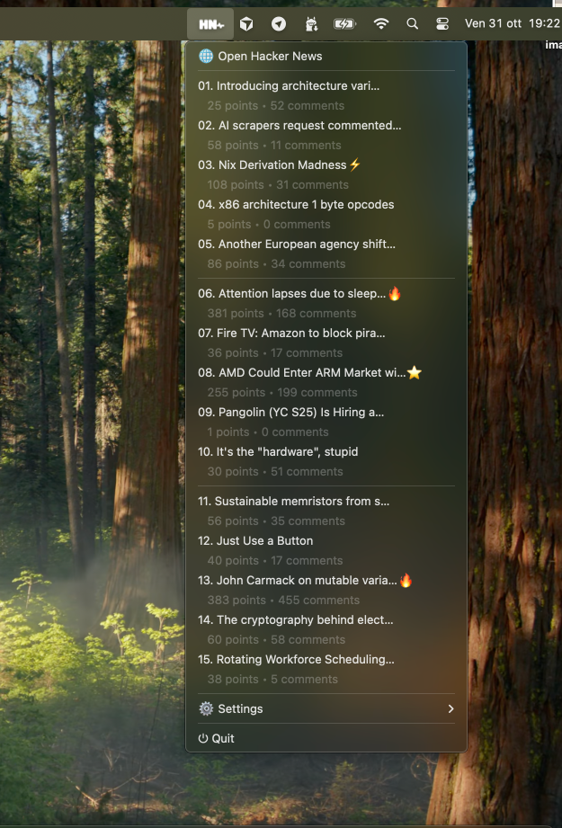
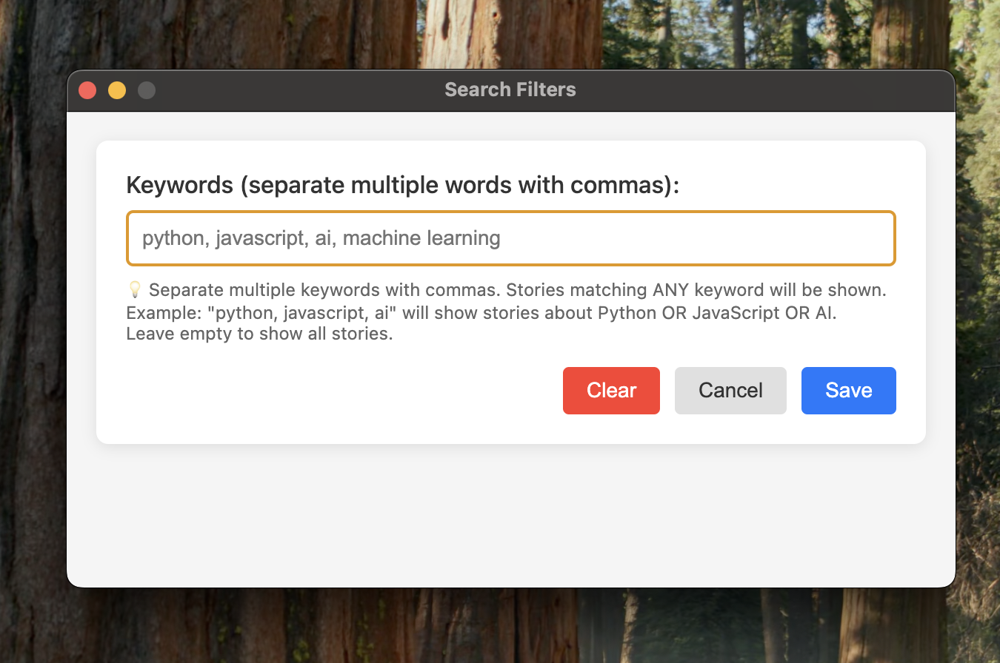
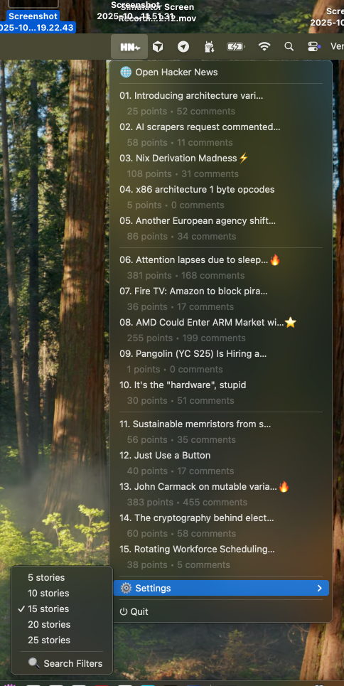

# HN Pulse

**Minimal Hacker News notifier that lives in your menu bar.**

HN Pulse is an Electron application that lives in your menu bar (macOS) or system tray (Windows/Linux) and automatically notifies you when there are interesting new stories on Hacker News.

## 📸 Screenshots







## 📋 Features

### 🎯 Smart Notifications

- **Trending story notifications**: Receive automatic notifications when a story becomes popular (score > 150 and comments > 50)
- **Custom filter notifications**: Configure keywords and receive notifications only for stories that interest you
- **Click to open**: Click on the notification to open the story directly on Hacker News

### 🔍 Custom Search Filters

- **Keyword search**: Add one or more keywords separated by commas
- **OR search**: Stories matching ANY keyword will be shown
- **Example**: `python, javascript, ai` will show stories about Python OR JavaScript OR AI
- **Configuration window**: Dedicated interface to easily manage filters

### 📰 Interactive Menu

- **Top stories**: View the most popular stories directly from the menu
- **Visual indicators**:
  - 🔥 Very popular stories (score > 300)
  - ⭐ Popular stories (score > 200)
  - ⚡ Interesting stories (score > 100)
  - ✨ Indicator for new stories not yet seen
- **Detailed information**: Each story shows points and number of comments
- **Click to open**: Click on a story to open it in your browser
- **Organization**: Separators every 5 stories for better readability

### 🔴 Notification Badge (macOS)

- **Dynamic badge**: Displays a red badge with the number of new stories
- **Smart counter**:
  - With active filters: counts all new stories matching the filters
  - Without filters: counts only trending stories (score > 150, comments > 50)
- **Positioning**: Badge centered on the icon in the menu bar
- **Format**: Shows exact number up to 99, then "99+"

### ⚙️ Customizable Configuration

- **Number of stories**: Choose how many stories to display in the menu (5, 10, 15, 20, or 25)
- **Persistence**: Settings are automatically saved
- **Quick access**: All options accessible from the Settings menu

### 🔄 Automatic Updates

- **Automatic checks**: The app checks for new stories every 10 minutes
- **Startup check**: Checks immediately when the app opens
- **Error handling**: Automatic retry in case of temporary network errors

### 💾 Data Persistence

- **Seen stories**: Tracks already viewed stories to avoid duplicate notifications
- **Configuration**: Saves preferences (number of stories, filters) between sessions
- **Data location**: Files are saved in the app's `userData` folder

## 🚀 Installation

### Prerequisites

- Node.js (version 14 or higher)
- npm

### Setup

1. Clone or download the repository
2. Install dependencies:
   ```bash
   npm install
   ```

### Running

```bash
npm start
```

### Build for Distribution

```bash
npm run build
```

This will create an installable application for:
- **macOS**: App bundle in the `dist` folder
- **Windows**: NSIS installer
- **Linux**: AppImage

## 📖 How to Use

### Accessing the Menu

- **macOS**: Click on the icon in the menu bar (top bar)
- **Windows/Linux**: Click on the icon in the system tray

### Configuring Search Filters

1. Open the menu and select **⚙️ Settings**
2. Click on **🔍 Search Filters**
3. Enter keywords separated by commas (e.g., `python, javascript, ai`)
4. Click **Save** or press **Enter**
5. To remove filters, click **Clear** or leave empty and save

### Changing the Number of Stories

1. Open the menu and select **⚙️ Settings**
2. Choose the desired number of stories (5, 10, 15, 20, or 25)
3. The menu updates automatically

### Viewing Stories

- Stories are automatically displayed in the main menu
- Click on a story to open it in your browser
- Stories are numbered and show visual indicators for popularity
- New stories not yet seen are marked with ✨

### Opening Hacker News

- Click on **🌐 Open Hacker News** in the menu to open the main site

## 🎨 Technical Features

### Supported Platforms

- ✅ macOS (with badge in menu bar)
- ✅ Windows
- ✅ Linux

### APIs Used

- **Hacker News Firebase API**: To fetch top stories
- **Electron**: Cross-platform desktop app framework
- **Sharp**: For dynamic badge generation on the icon

### Architecture

- **Menu bar app**: The app lives in the menu bar/system tray without main windows
- **Background checks**: Automatic checks every 10 minutes
- **Local storage**: Data saved locally in the file system

## 📝 Notes

- Notifications require permissions from the operating system
- On macOS, the dock icon is hidden to keep the app only in the menu bar
- Data is saved in the standard system application folder

## 🤝 Contributing

Contributions are welcome! If you'd like to contribute to HN Pulse, please feel free to:

1. Fork the repository
2. Create a feature branch (`git checkout -b feature/amazing-feature`)
3. Commit your changes (`git commit -m 'Add some amazing feature'`)
4. Push to the branch (`git push origin feature/amazing-feature`)
5. Open a Pull Request

### Development

To set up the development environment:

```bash
# Clone the repository
git clone https://github.com/acapilleri/hn-pulse.git
cd hn-pulse

# Install dependencies
npm install

# Run the app
npm start

# Build for distribution
npm run build
```

## 🐛 Issues

Found a bug or have a feature request? Please open an issue on the [GitHub Issues](https://github.com/acapilleri/hn-pulse/issues) page.

## 👤 Author

**Angelo Capilleri**
- Email: capirellleri@gmail.com
- LinkedIn: [angelocapilleri](https://www.linkedin.com/in/angelocapilleri/)

## 📄 License

This project is licensed under the MIT License - see the [LICENSE](LICENSE) file for details.

© 2025 Angelo Capilleri
